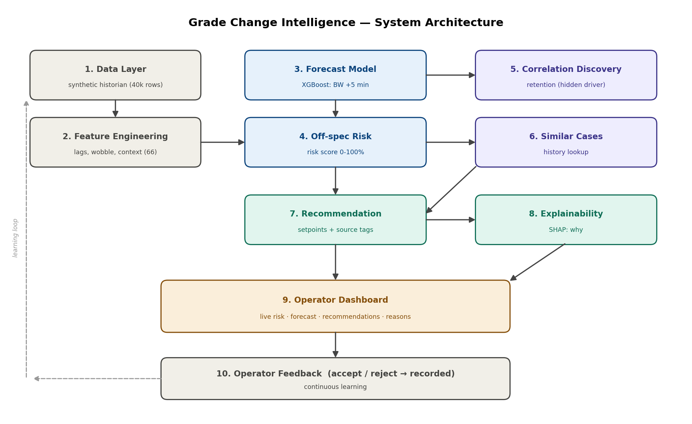
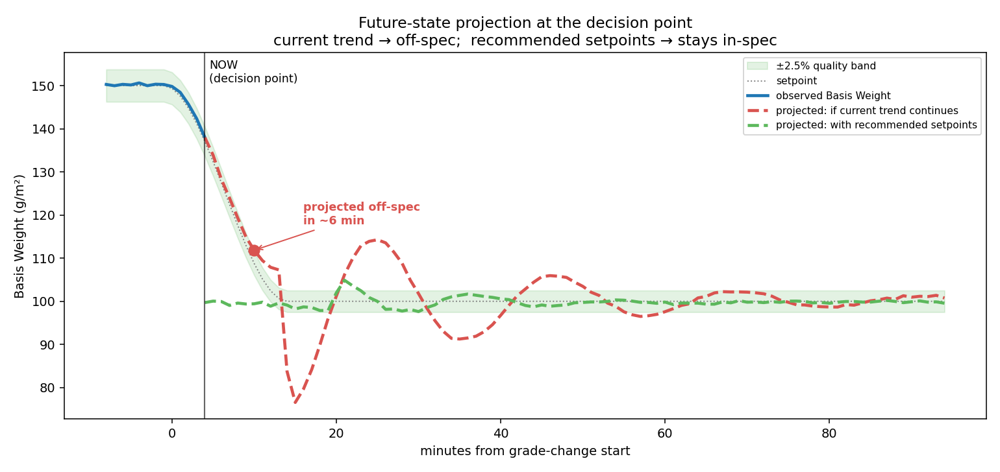
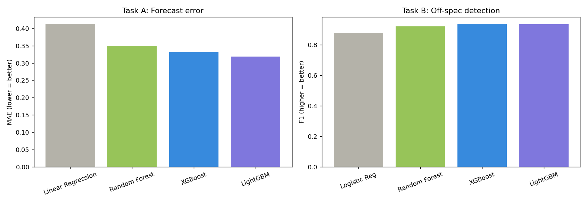
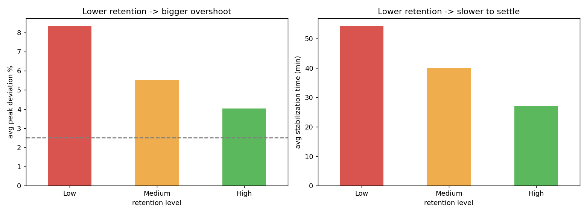
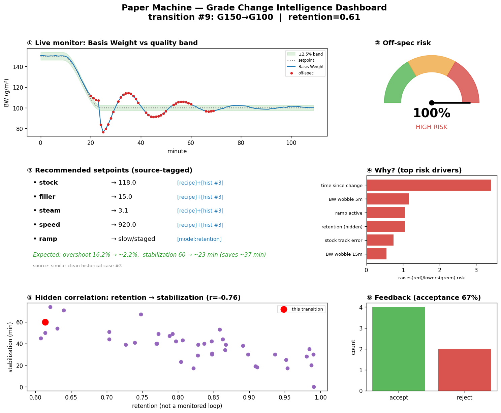

# Grade Change Intelligence in Paper Making Process

> An AI decision-support system that **predicts, prevents, and explains** quality deviations during paper-machine **grade changes** — cutting off-spec waste and stabilization time.

**Honeywell Hackathon — Problem Statement 5**
Shivam Sukhija · 20474401

**🎥 Live Demo (video + files):** https://drive.google.com/drive/folders/1oMQerlZm7KJ05tllAi2ms3LugmgCb49f?usp=drive_link
**💻 Repository:** https://github.com/sukhijashivam/Grade_Change_Intelligence

---

## The Problem

Paper machines produce different **grades** (paper weights). When switching grade (e.g. 100 → 120 GSM), the main quality variable **Basis Weight** overshoots its target and takes 40–70 minutes to settle. During this window the mill produces **off-spec paper (waste)**. Existing control (Honeywell QCS / MD-MPC) *executes* the change but does **not learn** from history.

**Goal:** an intelligence layer that
1. predicts when Basis Weight will go off-spec (>2.5%) *before* it happens,
2. recommends corrective setpoints,
3. reduces stabilization time, and
4. explains its reasoning.

---

## System Architecture



Data flows through prediction → risk → recommendation → explanation → dashboard, with hidden-correlation discovery and similar-case retrieval feeding the recommender, and an operator feedback loop enabling continuous learning.

---

## How It Works

| Module | What it does |
|--------|--------------|
| **Forecast** | Predicts Basis Weight 5 min ahead (XGBoost) |
| **Off-spec risk** | Live 0–100% risk score; warns **~26 min early** |
| **Future-state projection** | Projects the trajectory: current trend → off-spec; recommended setpoints → in-spec |
| **Recommendation** | Safe setpoints from recipe + similar successful past runs; **every suggestion is source-tagged** (recipe / historical / model) |
| **Hidden-correlation discovery** | Surfaces **retention** — a driver of stabilization the standard control loops don't monitor |
| **Explainability** | SHAP explains *why* each alert fired |
| **Dashboard + feedback** | One-screen operator view; accept/reject suggestions recorded for continuous learning |

---

## Results (held-out test week)

- **Off-spec detection:** F1 = **0.94**, recall = **0.90**, ROC-AUC = **0.99**
- **Early warning:** median **~26 min** before a quality breach
- **Recommendation impact (example):** overshoot **16% → 2%**, stabilization **60 → 23 min** (~37 min saved)
- **Model selection:** XGBoost chosen via a **4-model comparison**, all on a **time-based split** (no data leakage)

### Future-state projection at the decision point


*If the current trend continues, Basis Weight is projected to breach the ±2.5% band; applying the recommended setpoints keeps it in-spec.*

### Model comparison (why XGBoost)


---

## The Hidden Correlation We Discovered



**Retention** — not one of the standard MD control loops — turns out to be the single strongest predictor of stabilization time (|corr| ≈ 0.76). Lower retention → bigger overshoot and slower settling. This is the "new correlation not defined in the system" the challenge asked for.

---

## Operator Dashboard



Live Basis-Weight monitor, off-spec risk gauge, source-tagged setpoint recommendations, SHAP reasoning, the retention correlation, and the operator feedback log — all on one screen. A live **what-if demo** (`realtime_demo.py`) lets a user set the situation and see the model respond in real time.

---

## Repository Structure

```
Grade_Change_Intelligence/
├── README.md
├── requirements.txt
├── notebooks/     # Jupyter notebooks (end-to-end pipeline)
├── src/           # Python scripts (data gen, models, dashboard, demo)
├── data/          # Datasets (generated by generate_data.py)
├── images/        # Graphs, dashboard & demo screenshots
└── deck/          # Idea presentation (PPTX + PDF)
```

### Main scripts (`src/`)
| File | Purpose |
|------|---------|
| `generate_data.py` | Physics-informed synthetic paper-machine historian |
| `p2_features.py` | Feature engineering (lags, rolling wobble, context) |
| `p2_5_reduce.py` | Redundant-feature removal + correlation EDA |
| `p3_forecast.py` | Basis Weight forecast model |
| `p3b_model_compare.py` | 4-model comparison |
| `p4_offspec.py` | Off-spec risk classifier |
| `p5_discovery.py` | Hidden-correlation (retention) discovery |
| `p6_similar.py` | Similar historical-case retrieval |
| `p7_recommend.py` | Recommendation engine (source-tagged) |
| `p8_explain.py` | SHAP explainability |
| `p9_feedback.py` | Operator feedback loop |
| `dashboard.py` | Streamlit operator dashboard |
| `realtime_demo.py` | Live what-if demo (interactive) |
| `demo_end_to_end.py` | Scripted end-to-end demo |

---

## How to Run

```bash
# 1. Install dependencies
pip install -r requirements.txt

# 2. Generate the dataset
python src/generate_data.py

# 3. Build features -> reduce -> train models (in order)
python src/p2_features.py
python src/p2_5_reduce.py
python src/p3_forecast.py
python src/p4_offspec.py

# 4. Launch the interactive live demo
streamlit run src/realtime_demo.py
```

> The pipeline scripts read/write CSVs in the working directory — keep the generated CSVs alongside the scripts (or adjust paths) when running later stages.

---

## Design Decisions (interview highlights)

- **No production data was provided**, so we built a **physics-informed synthetic historian** with documented assumptions. The full pipeline runs unchanged on real plant data.
- **Time-based train/test split** (not random) to avoid look-ahead leakage.
- **Interpretability first:** correlation-based feature pruning instead of PCA, so SHAP and the recommender keep real, human-readable variable names.
- **Hybrid recommendations:** historical good runs + recipe limits, verified by the model, with a **source tag on every suggestion**.

---

## Tech Stack

Python · pandas · NumPy · scikit-learn · **XGBoost** · **LightGBM** · **SHAP** · **Streamlit** · Matplotlib

---

## References

- Honeywell Quality Control System (QCS) — MD Multivariable MPC grade change *(problem background)*
- T. Chen & C. Guestrin, *"XGBoost: A Scalable Tree Boosting System"*, KDD 2016
- S. Lundberg & S.-I. Lee, *"A Unified Approach to Interpreting Model Predictions"* (SHAP), NeurIPS 2017
- First-pass retention in papermaking — TAPPI wet-end chemistry concepts

---

## Note on Data

No production data was shared for this challenge. The dataset is **synthetic but physics-informed**, created to demonstrate the methodology. Reported metrics reflect this controlled setting; the same models and pipeline apply directly to real QCS/DCS historian data.
